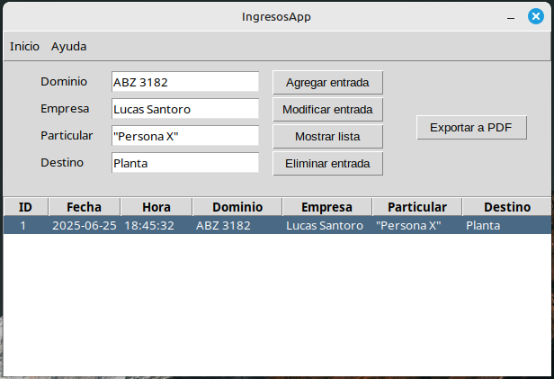
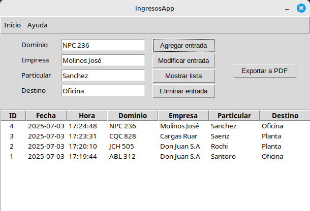
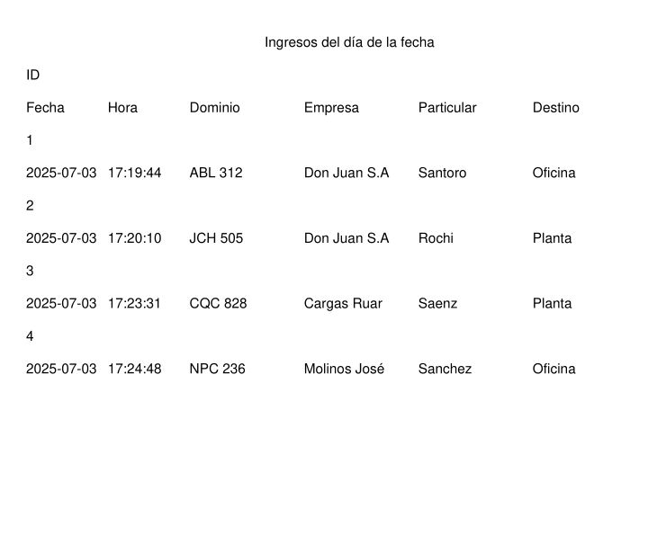

# 🚗​ IngresosApp

Aplicación de escritorio para registrar y controlar ingresos a un predio o establecimiento privado (Barrio cerrado, Parque Industrial, etc).  
Desarrollada en **Python**, con interfaz gráfica **Tkinter**, base de datos **SQLite3** y exportación de reportes en PDF.

---

## Vista previa



---

## Funcionalidades principales

- **CRUD completo:** Crear, modificar, leer y eliminar registros de ingresos.
- **Registro automático de fecha y hora:** Para asegurar veracidad de la información.
- **Visualización de registros:** Tabla interactiva con todos los datos.
- **Exportar a PDF:** Genera reportes con todos los ingresos registrados.
- **Interfaz intuitiva:** Sencilla y clara para cualquier usuario.

---

## Tecnologías y librerías utilizadas

- **Python 3:** Lenguaje principal.
- **Tkinter:** Para crear la ventana y los formularios.
- **SQLite3:** Base de datos embebida.
- **FPDF:** Para la generación de archivos PDF.
- **datetime:** Para capturar fecha y hora automáticamente.

---

## Estructura y variables clave

- **Variables:**  
  - `miDomain`, `miBusiness`, `miParticular`, `miDestination` → campos de información.  
  - `miDate`, `miHour` → se generan automáticamente al guardar o modificar.
- **Tabla de base de datos:**  
  - `empleado (ID, DATE, HOUR, DOMAIN, BUSINESS, PARTICULAR, DESTINATION)`
- **Ventana principal:**  
  - Entradas para dominio, empresa, particular y destino.
  - Botones para operaciones CRUD y exportar a PDF.
  - Tabla (`Treeview`) para mostrar los registros.
- **Funciones destacadas:**  
  - `crear()`: Inserta registro nuevo.
  - `actualizar()`: Modifica registro seleccionado.
  - `borrar()`: Elimina registro seleccionado.
  - `mostrar()`: Actualiza la tabla.
  - `exportar()`: Genera el PDF.

---

## ¿Cómo usarla?

1. **Requisitos**
   - Python 3
   - Instalar dependencias:
   ```bash
     pip install fpdf
   ```

1. **Ejecutar**
   ```bash
   python app.py
   ```
2.  **Interfaz**

   - Completa los campos y usa los botones para gestionar los registros.
   - La fecha y la hora se registran automáticamente.
   - Exporta a PDF cuando lo necesites.



---



---
English version
---
# 🚗 IngresosApp

Desktop application to register and control entries to a property or private facility (Gated community, Industrial park, etc).  
Developed in **Python**, with **Tkinter** graphical interface, **SQLite3** database, and PDF report export.

---

## Preview


---

## Main features

- **Full CRUD:** Create, update, read, and delete entry records.
- **Automatic date and time recording:** To ensure information accuracy.
- **Record visualization:** Interactive table with all data.
- **Export to PDF:** Generates reports with all registered entries.
- **Intuitive interface:** Simple and clear for any user.

---

## Technologies and libraries used

- **Python 3:** Main language.
- **Tkinter:** To create the window and forms.
- **SQLite3:** Embedded database.
- **FPDF:** For generating PDF files.
- **datetime:** To automatically capture date and time.

---

## Structure and key variables

- **Variables:**  
  - `miDomain`, `miBusiness`, `miParticular`, `miDestination` → information fields.  
  - `miDate`, `miHour` → generated automatically when saving or updating.
- **Database table:**  
  - `empleado (ID, DATE, HOUR, DOMAIN, BUSINESS, PARTICULAR, DESTINATION)`
- **Main window:**  
  - Inputs for domain, company, individual, and destination.
  - Buttons for CRUD operations and export to PDF.
  - Table (`Treeview`) to display the records.
- **Key functions:**  
  - `crear()`: Inserts a new record.
  - `actualizar()`: Modifies the selected record.
  - `borrar()`: Deletes the selected record.
  - `mostrar()`: Updates the table.
  - `exportar()`: Generates the PDF.

---

## How to use it?

1. **Requirements**
   - Python 3
   - Install dependencies:
   ```bash
     pip install fpdf
   ```
1. **Run**
   ```bash
   python app.py
   ```
2.  **Interface**

   - Fill in the fields and use the buttons to manage the records.
   - The date and time are recorded automatically.
   - Export to PDF whenever you need it.


---


